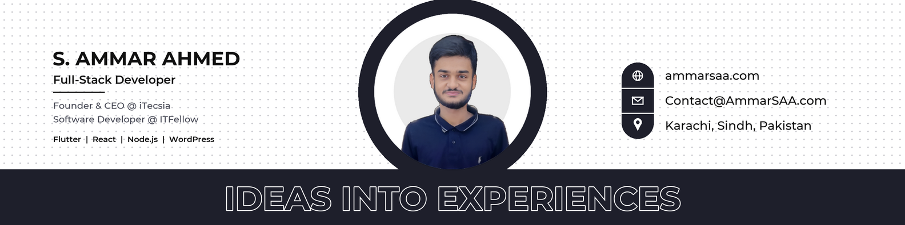

<h1 align="center">Hi, I'm Syed Ammar Ahmed</h1>
<h3 align="center">Full-Stack Developer · Flutter · React · Node.js · WordPress</h3>

  Founder &amp; CEO @ <a href="https://itecsia.com"><b>iTecsia</b></a> · Software Developer @ <b>ITFellow Solution Network</b> 
  Karachi, Pakistan

  I build web and mobile products end to end. At iTecsia we make web and mobile apps, AI chatbots and automation, ERP/CRM systems and cloud infrastructure for businesses.

  
  
  
  
  
  

## Featured Projects

| Project | What it is | Stack |
|---|---|---|
| [Hisaab Rakho 2.0](https://github.com/AmmarSAA/Hisaab-Rakho-2.0) | Personal finance app: track income, expenses and balance | Flutter, GetX |
| [Hisaab Rakho API](https://github.com/AmmarSAA/Hisaab-Rakho-API) | REST backend for Hisaab Rakho 2.0 | Node.js, json-server, Vercel |
| [Flash Games Directory](https://github.com/AmmarSAA/Flash-Games-Directory) | Preserving the legacy of Adobe Flash games (45 stars) | HTML, JavaScript |
| [ShopSmart](https://github.com/AmmarSAA/ShopSmart) | E-commerce platform | MERN |
| [Pharmacy POS](https://github.com/AmmarSAA/Pharmacy-POS) | Pharmacy billing and inventory: batch and expiry stock, prescription and controlled-drug rules, tills, supplier credit, AI assistant. Web, desktop and Android | Node.js, Express, MongoDB, Electron |
| [SAA Duplex Print](https://github.com/AmmarSAA/SAA-Duplex-Print) | Manual duplex printing for single-sided printers | Python |

## Tech Stack

**Frontend** 

**Backend & Databases** 

**Mobile** 

**CMS, Cloud & Tools** 

## Right Now

- Building **Hisaab Rakho 3.0**, a fuller budgeting app with wallets, budgets and reports
- Writing about AI-agent security and software engineering on [LinkedIn](https://linkedin.com/in/ammarsaa)
- Open to projects, partnerships and full-time opportunities

## GitHub Stats

---

Let's build something: <a href="mailto:Contact@AmmarSAA.com">Contact@AmmarSAA.com</a>

  

